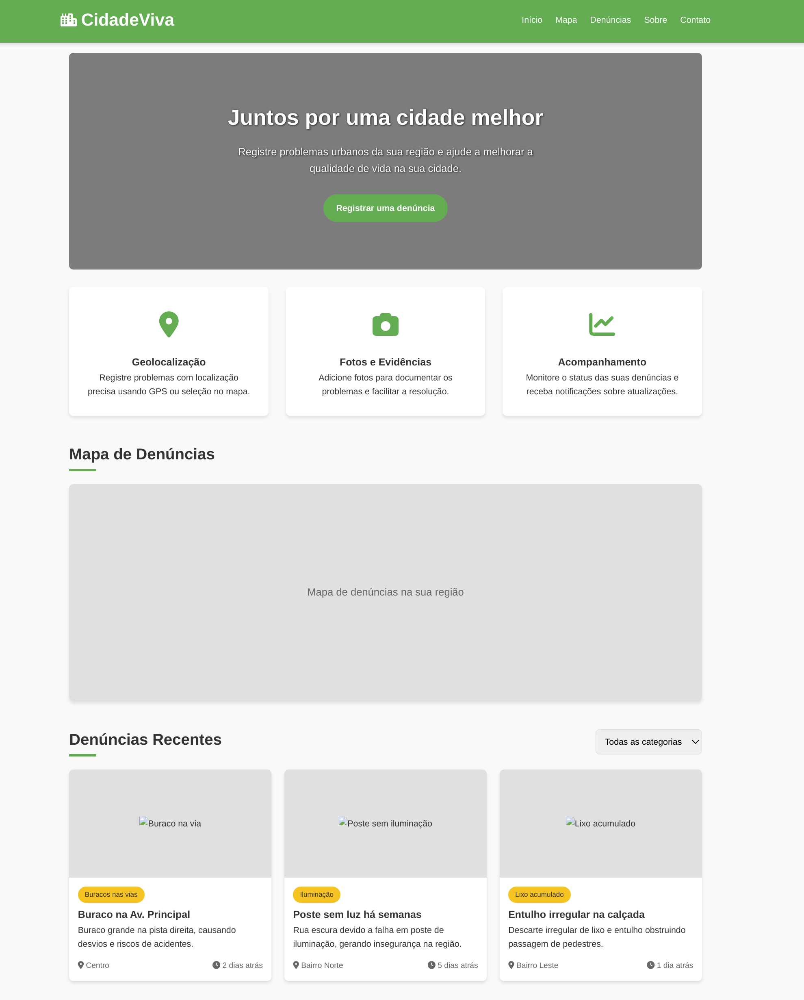

# CidadeViva

CidadeViva é uma plataforma web desenvolvida para permitir que cidadãos reportem problemas urbanos em suas comunidades. A plataforma facilita o registro, visualização e acompanhamento de denúncias relacionadas a problemas como buracos nas vias, iluminação pública, lixo acumulado e outros problemas urbanos.

## 🚀 Funcionalidades

- 📍 Geolocalização de problemas
- 📸 Upload de fotos e evidências
- 📊 Visualização em mapa
- 🔍 Filtro por categorias
- 📱 Design responsivo
- 🔔 Acompanhamento de denúncias

## 🖥️ Tecnologias Utilizadas

- HTML5
- CSS3
- JavaScript
- Font Awesome (ícones)
- Google Maps API (para visualização do mapa)

## 🎯 Objetivo

O objetivo principal do CidadeViva é criar uma ponte entre os cidadãos e os órgãos responsáveis pela manutenção urbana, facilitando a comunicação e o registro de problemas que afetam a qualidade de vida nas cidades.

## 📸 Screenshot

## 🛠️ Como Contribuir

1. Faça um fork do projeto
2. Crie uma branch para sua feature (`git checkout -b feature/AmazingFeature`)
3. Commit suas mudanças (`git commit -m 'Add some AmazingFeature'`)
4. Push para a branch (`git push origin feature/AmazingFeature`)
5. Abra um Pull Request

## 📝 Licença

Este projeto está sob a licença MIT. Veja o arquivo [LICENSE](LICENSE) para mais detalhes.

## ✉️ Contato

Diego Santos - [@diegosantosouza](https://github.com/diegosantosouza)

Link do Projeto: [https://github.com/diegosantosouza/cidade-viva](https://github.com/diegosantosouza/cidade-viva) 